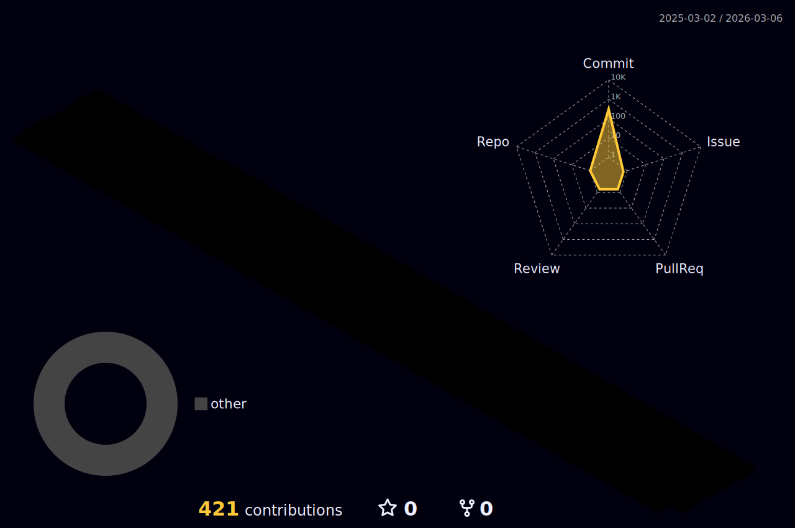

|  |  |
| ----------- | ----------- |

##

### 💻 Languages & Frameworks

---

### 🌐 Frontend & UI Frameworks

---

### 🖥️ Backend & Tools

---

### 🛢️ Databases

---

### 🔧 DevOps & Infra

---

### 🛠️ Tools

---

### 🌐 Social

##

  

